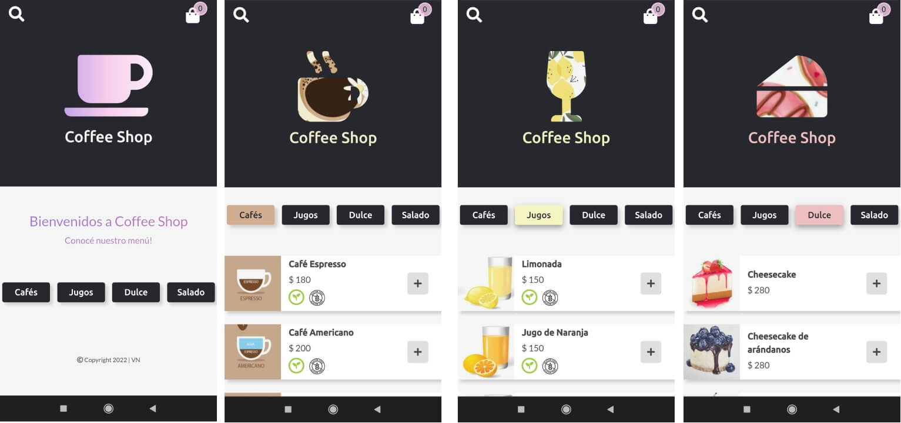
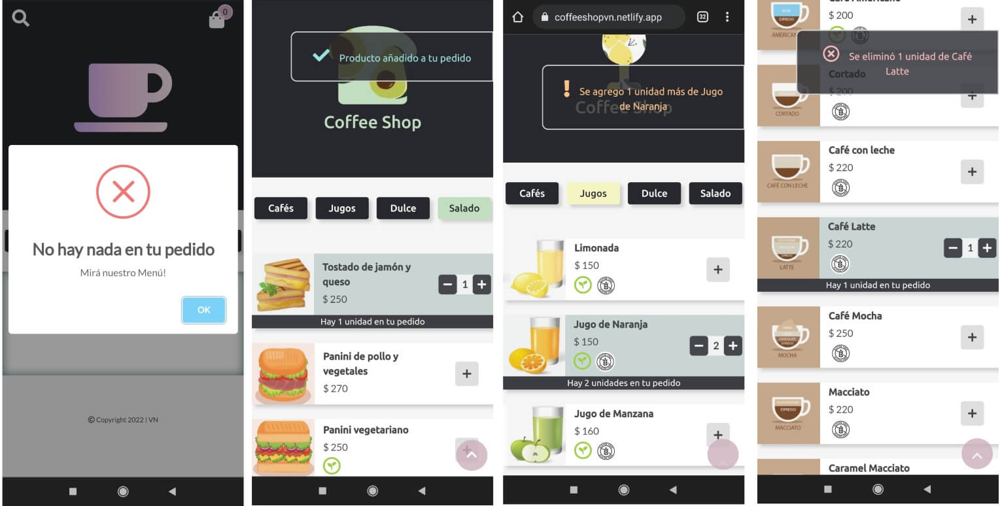
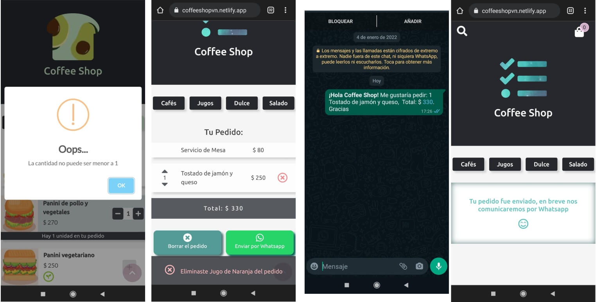

# Coffee Shop
Página Web sobre venta de productos de cafetería, desarrollada con JavaScript, Bootstrap, y estrategia mobile first.

## Demo - Coffee Shop
### Web
[Coffee Shop](https://coffeeshopvn.netlify.app/) 

### Mobile

## Desarrollo
- Para su desarrollo se ha utilizado HTML5, CSS3, JavaScript y Bootstrap (v 5.15.1).
- Desarrollo con estrategia Mobile First, web responsive, mediante el uso de mediaqueries.
- Para las animaciones se ha utilizado la librería Animate.css (v 4.1.1) y animaciones de background.
- También se utilizó Google Fonts, Fontawesome, y SweetAlert.
- Se ha utilizado Git para el control de versiones.

## Author
GitHub: [victorianastasi](https://github.com/victorianastasi)

LinkedIn:  [Victoria Nastasi](https://www.linkedin.com/in/victoria-nastasi-74b007237/)